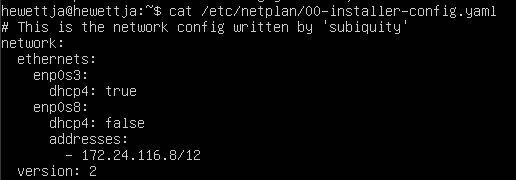
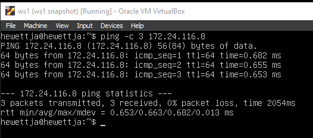
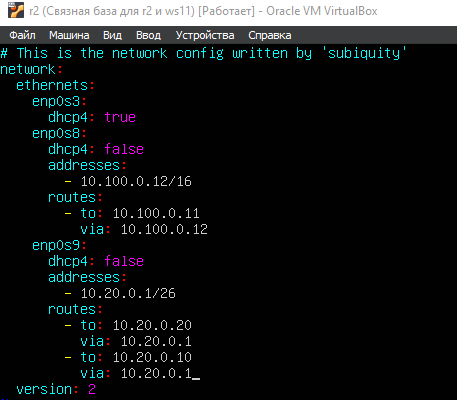
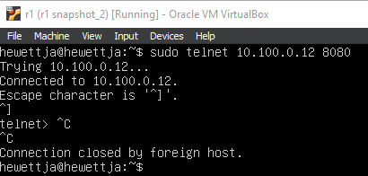

## Part 1 Инструмент ipcalc
### 1.1
- 1\) 
- адрес сети 192.167.38.54/13 - 192.160.0.0

- 2\) 
- `перевод маски 255.255.255.0 в префиксную и двоичную запись:`
- 255.255.255.0 - 24 единички, следовательно префиксная запись: /24. Двоичная: 11111111.11111111.11111111.00000000
- `/15 в обычную и двоичную:`
- 15 единичек, в двоичной: 11111111.11111110.00000000.00000000, в обычной: 255.254.0.0
- `11111111.11111111.11111111.11110000 в обычную и префиксную`
- 28 единичек - /28. В обычной: 255.255.255.240
- 3\) `минимальный и максимальный хост в сети 12.167.38.4 при масках:`
- `/8` : min: 12.0.0.1, max: 12.255.255.254

- `11111111.11111111.00000000.00000000` : min: 12.167.0.1, max: 12.167.255.254

- `255.255.254.0`: min : 12.167.38.1, max: 12.167.39.254

- `/4`: min : 0.0.0.1 max: 15.255.255.254

### 1.2
- `Определить и записать в отчёт, можно ли обратиться к приложению, работающему на localhost, со следующими IP: 194.34.23.100, 127.0.0.2, 127.1.0.1, 128.0.0.1`
- диапазон локалхоста: 127.0.0.1 - 127.255.255.254
- 194.34.23.100: нельзя
- 127.0.0.2: можно
- 127.1.0.1: можно
- 128.0.0.1: нельзя
### 1.3
- 1\) `какие из перечисленных IP можно использовать в качестве публичного, а какие только в качестве частных: 10.0.0.45, 134.43.0.2, 192.168.4.2, 172.20.250.4, 172.0.2.1, 192.172.0.1, 172.68.0.2, 172.16.255.255, 10.10.10.10, 172.68.0.2, 192.169.168.1`
- публичные: 134.43.0.2, 172.0.2.1, 192.172.0.1, 172.68.0.2, 192.169.168.1
- частные: 10.0.0.45, 192.168.4.2, 172.20.250.4, 172.16.255.255, 10.10.10.10
- 2\) `какие из перечисленных IP адресов шлюза возможны у сети 10.10.0.0/18: 10.0.0.1, 10.10.0.2, 10.10.10.10, 10.10.100.1, 10.10.1.255`
- возможны: 10.10.0.2, 10.10.10.10, 10.10.1.255
- не возможны: 10.0.0.1, 10.10.100.1

## Part 2 Статическая маршрутизация между двумя машинами
- `ip a` на двух машинах
- ws1:

- ws2:

- `Описать сетевой интерфейс, соответствующий внутренней сети`
    - Сетевой интерфейс для внутренней сети - enp0s8.
- `etc/netplan/00-installer-config.yaml ws1:`

- `etc/netplan/00-installer-config.yaml ws2:`

- `sudo netplan apply ws1:`

- `sudo netplan apply ws2:`

### 2.1. Добавление статического маршрута вручную
- `Добавить статический маршрут от одной машины до другой и обратно при помощи команды вида ip r add`
- ws1:

- ws2:

- `Пропинговать соединение между машинами`:
- ws1:

- ws2:

### 2.2. Добавление статического маршрута с сохранением

- `Добавить статический маршрут от одной машины до другой с помощью файла etc/netplan/00-installer-config.yaml`

- ws1:

- ws2:

- `Пропинговать соединение между машинами`

- ws1:

- ws2:

## Part 3 Утилита iperf3

### 3.1. Скорость соединения

- `Перевести и записать в отчёт: 8 Mbps в MB/s, 100 MB/s в Kbps, 1 Gbps в Mbps`

- 8 Mbps = 1 MB/s
- 100 MB/s = 800000 Kbps
- 1 Gbps = 1000 Mbps

### 3.2. Утилита iperf3

- `Измерить скорость соединения между ws1 и ws2`

- ws1:

- ws2:

## Part 4 Сетевой экран

### 4.1. Утилита iptables

- /etc/firewall ws1

- /etc/firewall ws2

- `Запуск обоих файлов`

- ws1:

- ws2:

- Разница в стратегиях заключается в том, что изначально в машине ws1 мы сначала запрещаем, поэтому правило разрешения снизу не обрабатывается. В машине ws2 всё ровным счетом наоборот.

### 4.2. Утилита nmap

- `Командой ping найти машину, которая не "пингуется", после чего утилитой nmap показать, что хост машины запущен`

- проверяем пингом:

- ws1 не пингуется:

- ws2 пингуется:

- nmap

## Part 5. Статическая маршрутизация сети

### 5.1. Настройка адресов машин

- `Настроить конфигурации машин в etc/netplan/00-installer-config.yaml согласно сети на рисунке`

- r1:

- r2:

- ws11:

- ws21:

- ws22:

- `Перезапустить сервис сети. Если ошибок нет, то командой ip -4 a проверить, что адрес машины задан верно. Также пропинговать ws22 с ws21. Аналогично пропинговать r1 с ws11.`

- r1:

- r2:

- ws11:

- ws22:

- ws21:

### 5.2. Включение переадресации IP-адресов.

- `Для включения переадресации IP, выполните команду на роутерах: sysctl -w net.ipv4.ip_forward=1`

- r1: 

- r2: 

- `Откройте файл /etc/sysctl.conf и добавьте в него следующую строку:net.ipv4.ip_forward = 1`

- r1: 

- r2:

### 5.3. Установка маршрута по-умолчанию

- `Настроить маршрут по-умолчанию (шлюз) для рабочих станций. Для этого добавить default перед IP роутера в файле конфигураций`

- r1:

- r2:

- ws11:

- ws21:

- ws22:

- `Вызвать ip r и показать, что добавился маршрут в таблицу маршрутизации`

- r1: 

- r2:

- ws11:

- ws21:

- ws22:

- `Пропинговать с ws11 роутер r2 и показать на r2, что пинг доходит`

- ping:

- tcpdump:

### 5.4. Добавление статических маршрутов

- `Добавить в роутеры r1 и r2 статические маршруты в файле конфигураций`

- r1:

- r2:

- `Вызвать ip r и показать таблицы с маршрутами на обоих роутерах.`

- r1:

- r2:

- `Запустить команды на ws11:`

- Для адреса 10.10.0.0/18 был выбран маршрут, отличный от 0.0.0.0/0, поскольку он является адресом сети и доступен без шлюза.

## 5.5. Построение списка маршрутизаторов

- `Запустить на r1 команду дампа:`

- `При помощи утилиты traceroute построить список маршрутизаторов на пути от ws11 до ws21`

- Анализ вывода tcpdump позволяет проследить процесс построения пути с помощью утилиты traceroute в Linux. Traceroute использует увеличивающееся значение Time-To-Live (TTL) в заголовке IP-пакета, отправляемого к целевому узлу. При каждом шаге TTL увеличивается, что заставляет маршрутизаторы на пути отправить обратно ICMP Time Exceeded сообщение, указывая на истекший TTL. Анализ icmp-пакетов с помощью tcpdump позволяет видеть IP-адреса маршрутизаторов, через которые проходит пакет, и время, затраченное на прохождение до каждого из них. Это позволяет определить последовательность промежуточных узлов и оценить задержки на участках маршрута до целевого узла.

### 5.6. Использование протокола ICMP при маршрутизации

- `Запустить на r1 перехват сетевого трафика`

- `Пропинговать с ws11 несуществующий IP (например, 10.30.0.111)`

## Part 6. Динамическая настройка IP с помощью DHCP

- `Для r2 настроить в файле /etc/dhcp/dhcpd.conf конфигурацию службы DHCP:`

- `1) указать адрес маршрутизатора по-умолчанию, DNS-сервер и адрес внутренней сети.`

- `2) в файле resolv.conf прописать nameserver 8.8.8.8.`

- `Перезагрузить службу DHCP командой systemctl restart isc-dhcp-serve`

- `Машину ws21 перезагрузить при помощи reboot и через ip a показать, что она получила адрес. Также пропинговать ws22 с ws21.`

- ws22 to ws21 ping:

- `Указать MAC адрес у ws11, для этого в etc/netplan/00-installer-config.yaml надо добавить строки: macaddress: 10:10:10:10:10:BA, dhcp4: true`

- `Для r1 настроить аналогично r2, но сделать выдачу адресов с жесткой привязкой к MAC-адресу (ws11). Провести аналогичные тесты`

- dhcpd.conf:

- resolv.conf:

- restart:

- ip a:

- `Запросить с ws21 обновление ip адреса`

- до:

- после:

- использованные команды
- `sudo dhclient -r enp0s3`
- `sudo dhclient enp0s3`

## Part 7. NAT

- `В файле /etc/apache2/ports.conf на ws22 и r2 изменить строку Listen 80 на Listen 0.0.0.0:80, то есть сделать сервер Apache2 общедоступным.`

- r1:

- ws22:

- `Запустить веб-сервер Apache командой service apache2 start на ws22 и r1`

- r1:

- ws22:

- `Добавить в фаервол, созданный по аналогии с фаерволом из Части 4, на r2 следующие правила:`

- 1) удаление правил в таблице filter - iptables -F
- 2) удаление правил в таблице "NAT" - iptables -F -t nat
- 3) отбрасывать все маршрутизируемые пакеты - iptables --policy FORWARD DROP

- `Проверить соединение между ws22 и r1 командой ping
- При запуске файла с этими правилами, ws22 не должна "пинговаться" с r1

- r1 to ws22:

- ws22 to r1:

- `Добавить в файл ещё одно правило:`

- 4) разрешить маршрутизацию всех пакетов протокола ICMP

- `Проверить соединение между ws22 и r1 командой ping`

- При запуске файла с этими правилами, ws22 должна "пинговаться" с r1

- r1 to ws22:

- ws22 to r1:

- `Добавить в файл ещё два правила:`

5) включить SNAT, а именно маскирование всех локальных ip из локальной сети, находящейся за r2 (по обозначениям из Части 5 - сеть 10.20.0.0)
Совет: стоит подумать о маршрутизации внутренних пакетов, а также внешних пакетов с установленным соединением

6) включить DNAT на 8080 порт машины r2 и добавить к веб-серверу Apache, запущенному на ws22, доступ извне сети

- `Проверить соединение по TCP для SNAT, для этого с ws22 подключиться к серверу Apache на r1`:

- `Проверить соединение по TCP для DNAT, для этого с r1 подключиться к серверу Apache на ws22`:

## Part 8. Дополнительно. Знакомство с SSH Tunnels

- `Запустить веб-сервер Apache на ws22 только на localhost (то есть в файле /etc/apache2/ports.conf изменить строку Listen 80 на Listen localhost:80)`

- запуск:

- `воспользоваться Local TCP forwarding с ws21 до ws22, чтобы получить доступ к веб-серверу на ws22 с ws21`

- `Воспользоваться Remote TCP forwarding c ws11 до ws22, чтобы получить доступ к веб-серверу на ws22 с ws11`

- `Для проверки, сработало ли подключение в обоих предыдущих пунктах, перейдите во второй терминал (например, клавишами Alt + F2) и выполните команду:
telnet 127.0.0.1 [локальный порт]`

- ws21:

- ws11:

